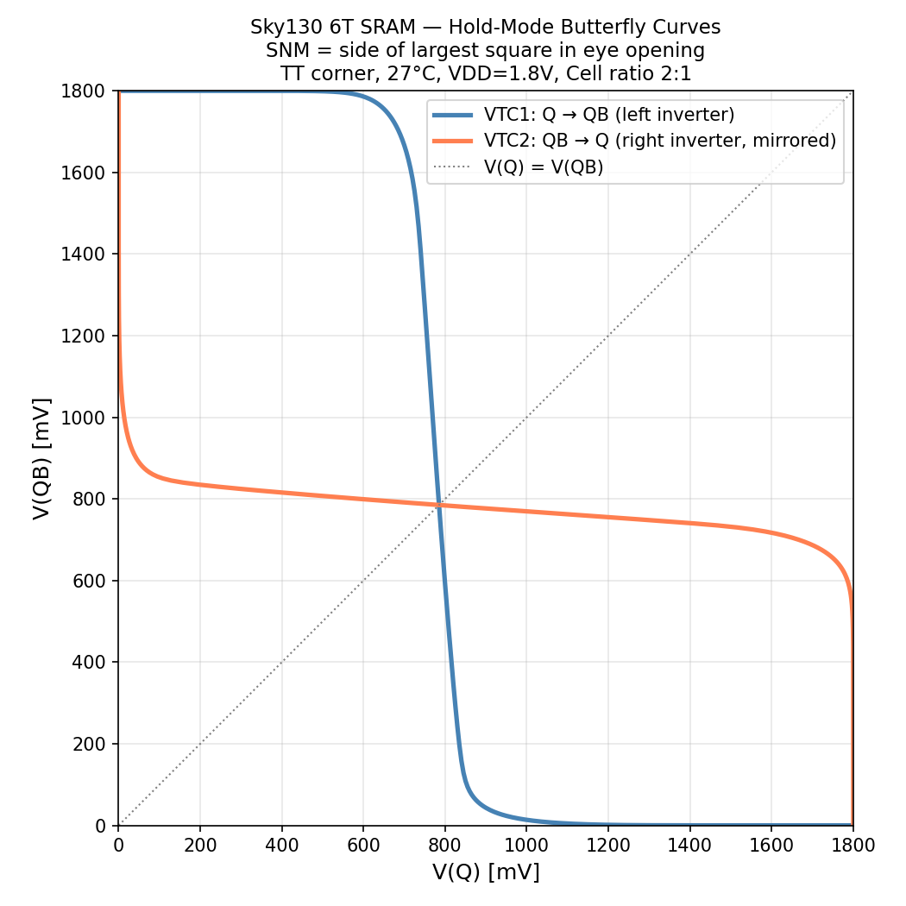
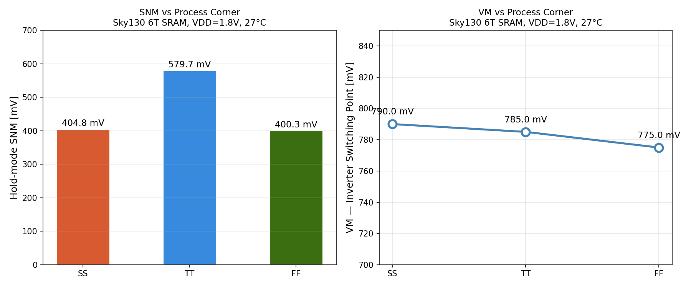
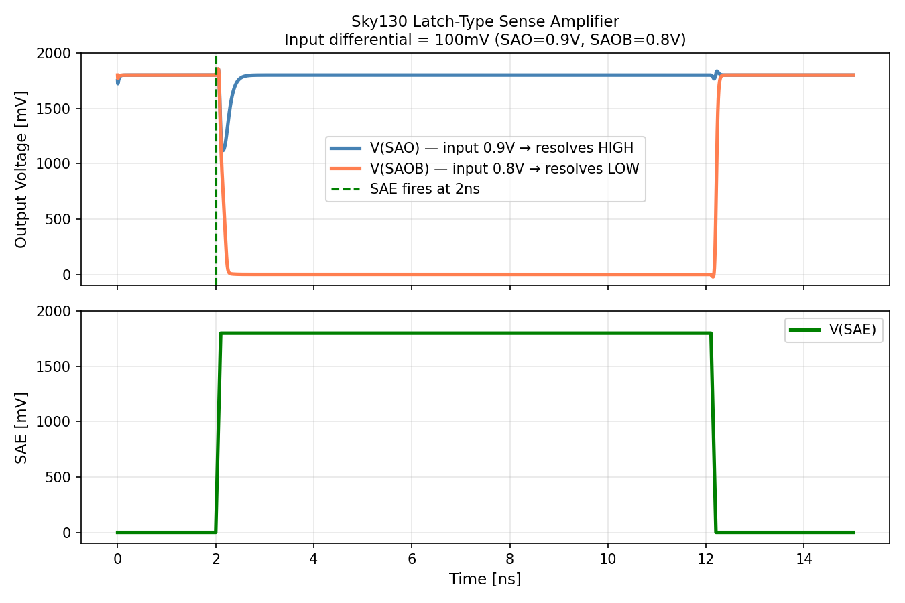

# Sky130 SRAM Memory Subsystem

**Daniel Yoon | NC State University | Electrical Engineering + Statistics**

A three-module semiconductor portfolio project spanning SRAM
characterization, MBIST controller design, and RTL-to-GDSII physical
design — all using the open-source Sky130 130nm PDK.

Built to demonstrate memory engineering skills targeting test
engineering, product validation, and applications engineering roles
at companies including Samsung Semiconductor, SK hynix, Texas
Instruments, and Analog Devices.

---

## Project Structure

| Module | Topic | Key Result |
|--------|-------|------------|
| [Module 1](module1-sram-char/) | 6T SRAM Characterization | Hold SNM 579.7 mV, Read disturb 148.7 mV |
| [Module 2](module2-mbist/) | March C− MBIST Controller | 100% SAF/TF, 72% CF, 188 cells in Sky130 |
| [Module 3](module3-physical-design/) | RTL-to-GDSII Physical Design | DRC/LVS clean, 13.82 ns slack, 0.233 mW |

---

## Module 1 — 6T SRAM Cell Characterization

Full electrical characterization of a Sky130 6T SRAM bitcell using
ngspice SPICE simulation. Covers hold state, write operation, read
disturb, SNM extraction, sense amplifier timing, and process corner
analysis.

### Key Results
| Metric | Value |
|--------|-------|
| Hold-mode SNM (TT, 27°C) | 579.7 mV |
| Estimated read-mode SNM | 469.9 mV |
| Read disturb voltage | 148.7 mV |
| Safety margin (disturb vs SNM) | 431.0 mV |
| Sense amplifier resolution time | 231.5 ps (50 mV differential) |
| Inverter VM — SS corner | 790.0 mV |
| Inverter VM — TT corner | 785.0 mV |
| Inverter VM — FF corner | 775.0 mV |

### Figures
| Figure | Description |
|--------|-------------|
|  | Hold-mode butterfly curves, SNM extraction |
|  | Corner analysis — SNM and VM vs SS/TT/FF |
|  | Sense amplifier 231.5 ps resolution |

---

## Module 2 — March C− MBIST Controller

Synthesizable March C− memory test controller in Verilog with
fault-diagnosis mode, verified against a behavioral 256×8 SRAM model
with three fault injection models.

### Key Results
| Metric | Value |
|--------|-------|
| SAF fault coverage | 100% (50/50) |
| TF fault coverage | 100% (50/50) |
| CF fault coverage | 72% (36/50) |
| Overall coverage | 90% (136/150) |
| Synthesized cells | 188 |
| Flip-flops | 47 |
| Chip area (Sky130) | 2,015.68 µm² |

### Figure

---

## Module 3 — RTL-to-GDSII Physical Design

Full RTL-to-GDSII physical design flow using OpenLane 2 and Sky130A.
Produced a DRC-clean, LVS-clean, timing-closed layout.

### Key Results
| Metric | Value |
|--------|-------|
| Die area | 76.8 × 87.6 µm |
| Setup slack (TT corner) | 13.82 ns |
| Hold slack (TT corner) | 0.304 ns |
| Timing violations | 0 |
| Total power | 0.233 mW |
| DRC | ✓ Clean |
| LVS | ✓ Clean |

### Figure

---

## Tools and Environment
| Tool | Version | Purpose |
|------|---------|---------|
| ngspice | 36 | SPICE simulation |
| Sky130A PDK | 0fe599b | Transistor models and standard cells |
| Icarus Verilog | 11.0 | Verilog simulation |
| Yosys | 0.9 / 0.46 | RTL synthesis |
| OpenLane | 2.3.10 | RTL-to-GDSII flow |
| KLayout | 0.29 | Layout viewing |
| Python | 3.10 | Data processing and visualization |
| WSL2 Ubuntu | 22.04 | Development environment |

---

## Skills Demonstrated
- SPICE transistor-level simulation (Sky130 PDK)
- SRAM cell characterization and SNM extraction
- Process corner analysis (SS/TT/FF)
- Verilog RTL design and FSM implementation
- Memory fault models (SAF, TF, CF)
- March C− test algorithm implementation
- Digital verification and testbench development
- Logic synthesis (Yosys)
- Physical design (floorplan, placement, CTS, routing)
- Static timing analysis
- DRC/LVS sign-off