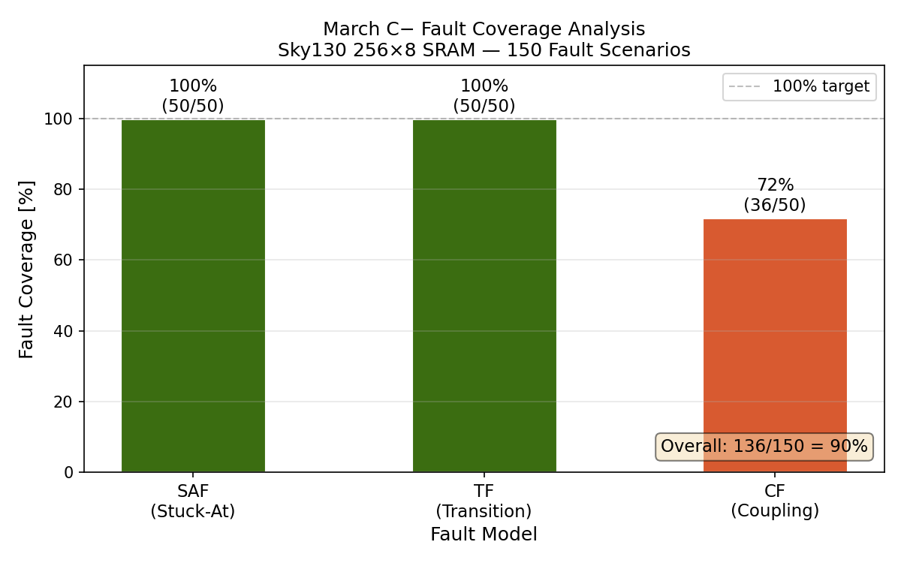

# Module 2 — Memory BIST Controller

## Overview
Synthesizable March C− Memory Built-In Self-Test (MBIST) controller
implemented in Verilog, verified against a behavioral 256×8 SRAM model
with three fault injection models. Synthesized to real Sky130 standard
cells via Yosys.

## What is MBIST?
Every memory chip shipped by Samsung, SK hynix, and Micron runs a
Built-In Self-Test at power-on before the memory controller trusts the
array. The test algorithm writes and reads specific patterns designed to
detect manufacturing defects. This module implements that exact flow.

## Algorithm — March C−
March C− consists of 5 elements applied across all 256 addresses:

| Element | Direction | Operations | Purpose |
|---------|-----------|------------|---------|
| E0 | Ascending ↑ | w0 | Initialize all cells to 0 |
| E1 | Ascending ↑ | r0, w1 | Verify 0, write 1 |
| E2 | Ascending ↑ | r1, w0 | Verify 1, write 0 |
| E3 | Descending ↓ | r0, w1 | Verify 0, write 1 |
| E4 | Descending ↓ | r1 | Verify 1 |

Total complexity: 10n operations for n-cell array.
For 256×8 = 2048 bits: 20,480 memory operations.

## Fault Models

| Fault | Description | Physical Cause |
|-------|-------------|----------------|
| SAF | Bit always reads same value | Short to VDD or GND |
| TF | Cannot transition 0→1 or 1→0 | Weak write path |
| CF | Writing aggressor flips victim | Capacitive coupling |

## Key Results

### Fault Coverage
| Fault Type | Total | Detected | Coverage |
|------------|-------|----------|----------|
| SAF (Stuck-At) | 50 | 50 | 100% |
| TF (Transition) | 50 | 50 | 100% |
| CF (Coupling) | 50 | 36 | 72% |
| **Overall** | **150** | **136** | **90%** |

March C− achieves 72% CF coverage because it does not generate
all aggressor-victim sequence pairs. March SS closes this gap.

### Synthesis Results (Sky130 HD, TT corner, 25°C, 1.8V)
| Metric | Value |
|--------|-------|
| Total cells | 188 |
| Flip-flops | 47 |
| Chip area | 2,015.68 µm² |
| Tool | Yosys 0.9 |
| PDK | Sky130A HD |

### Fault Coverage Chart


## Controller Features
- Synthesizable Verilog FSM — 7 states, 3-phase timing
- Sticky-fail pass/fail flag — latches first failure permanently
- Diagnosis mode — captures first failing address in diag_addr
- March C− algorithm — 10n complexity, 100% SAF/TF coverage

## Files
rtl/
mbist_ctrl.v      — synthesizable March C- FSM controller
sram_256x8.v      — behavioral SRAM with fault injection
synth_mbist.ys    — Yosys synthesis script
tb/
tb_mbist_basic.v  — baseline verification (fault-free)
tb_fault_coverage.v — coverage analysis testbench
results/
fault_coverage.png    — coverage bar chart
mbist_ctrl_synth.v    — synthesized gate-level netlist
scripts/
plot_coverage.py  — coverage visualization

## How to Reproduce
```bash
# Verify fault-free baseline
cd module2-mbist/tb
iverilog -o tb_mbist_basic tb_mbist_basic.v \
    ../rtl/mbist_ctrl.v ../rtl/sram_256x8.v
vvp tb_mbist_basic

# Run coverage analysis
iverilog -o tb_fault_coverage tb_fault_coverage.v \
    ../rtl/mbist_ctrl.v ../rtl/sram_256x8.v
vvp tb_fault_coverage

# Synthesize controller
cd ../rtl
yosys synth_mbist.ys

# Generate coverage chart
cd ../scripts
python3 plot_coverage.py
```
