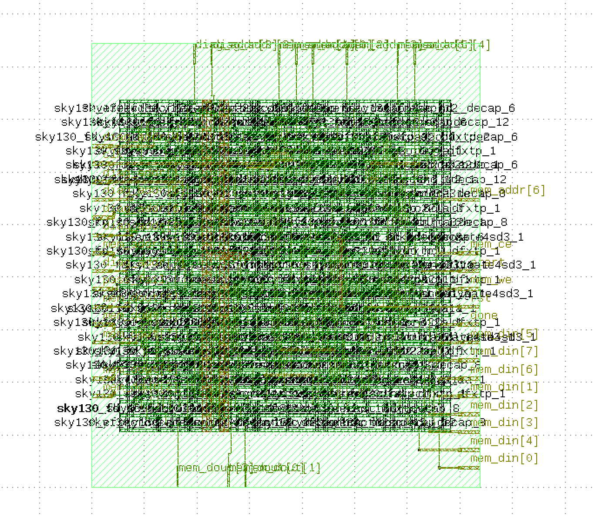

# Module 3 — RTL-to-GDSII Physical Design

## Overview
Full RTL-to-GDSII physical design flow for the MBIST controller using
OpenLane 2 and the Sky130A 130nm open-source PDK. Produced a
DRC-clean, LVS-clean, timing-closed layout ready for fabrication.

## Flow Summary
mbist_ctrl.v (Verilog RTL)
↓
Synthesis (Yosys 0.46)
↓
Floorplan (OpenROAD)
↓
Placement (OpenROAD)
↓
Clock Tree Synthesis
↓
Routing (OpenROAD)
↓
DRC / LVS Sign-off (Magic + KLayout)
↓
GDSII (fabrication-ready)

## Key Results

### Physical Design Metrics
| Metric | Value |
|--------|-------|
| Die area | 76.8 × 87.6 µm |
| Core utilization | 55% |
| Total cells | 193 |
| Sequential cells (FFs) | 40 |
| Tool | OpenLane 2.3.10 |
| PDK | Sky130A HD |

### Timing Results (post-route)
| Corner | Setup Slack | Hold Slack | Violations |
|--------|-------------|------------|------------|
| TT 25°C 1.8V | 13.82 ns | 0.304 ns | 0 |
| SS 100°C 1.6V | 11.85 ns | 0.815 ns | 0 |
| FF -40°C 1.95V | — | 0.114 ns | 0 |

Clock period: 20 ns (50 MHz target)
Maximum achievable frequency: ~162 MHz (1/6.18ns critical path)

### Power Analysis (TT corner)
| Component | Power |
|-----------|-------|
| Internal | 0.170 mW |
| Switching | 0.063 mW |
| Leakage | 0.000003 mW |
| **Total** | **0.233 mW** |

### Sign-off
| Check | Result |
|-------|--------|
| DRC (Design Rule Check) | ✓ Passed |
| LVS (Layout vs Schematic) | ✓ Passed |
| Antenna Check | ✓ Passed |

## Layout


*Placed and routed MBIST controller in Sky130 130nm.
Green layers show metal routing and standard cell placement.
Port labels visible on die boundary (mem_addr, diag_addr, done, etc.)*

## Files
config/
config.json                    — OpenLane flow configuration
results/
mbist_ctrl.gds                 — GDSII fabrication file
metrics.json                   — Full PPA metrics from OpenLane
Screenshot 2026-05-11 ...png   — KLayout layout view

## How to Reproduce
```bash
cd module3-physical-design
sudo service docker start
python3 -m openlane --dockerized \
    --pdk-root /home/dyoon06/pdk \
    config/config.json
```